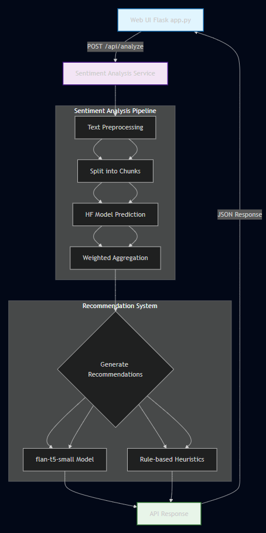

# Архитектура агента оценки звонков (Flask + RU-сентимент)

### Поток данных

1. Пользователь вставляет **транскрипт звонка** в форму на Flask.
2. **Flask** отправляет текст в `SentimentAggregator`:
   - Разбивает на предложения.
   - Разбивает на чанки по токенам.
   - Оценивает каждый чанк RU-сентимент моделью (`blanchefort/rubert-base-cased-sentiment`).
   - Аггрегирует вероятности в итоговый тон и уверенность.
3. **Recommender** генерирует 1–2 коротких рекомендации:
   - Через LLM (`flan-t5-small`) или эвристики (по ключевым словам и тональности).
4. **Flask** возвращает:
   - На веб-странице: тон, вероятность, рекомендации.
   - Через REST API `/api/analyze`: JSON с теми же полями.
5. Можно подключить **n8n** или другой оркестратор, используя REST API.

### Особенности

- Поддержка **длинных звонков** через разбивку на чанки по токенам.
- Легкая замена модели сентимента на другую RU-модель Hugging Face.
- Генерация рекомендаций гибкая: LLM или простые эвристики.
- Flask объединяет UI и API в одном приложении.